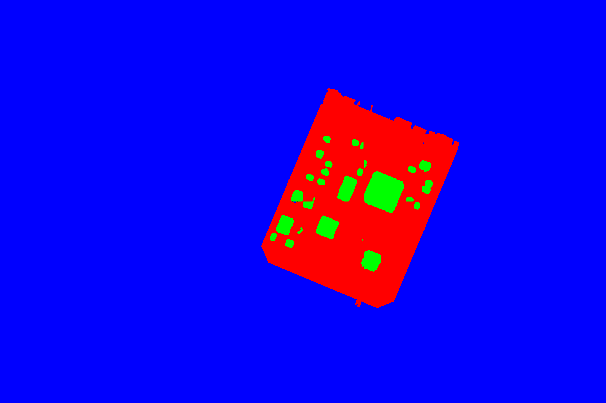
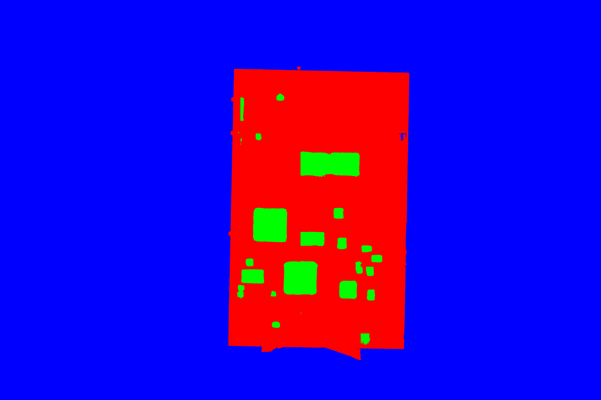

# PCB Image Segmentation using Multi-UNet

This is a Python project for PCB Image Segmentation using Multi-UNet. In this project, we have used Multi-UNet architecture to segment PCB images into background, IC and PCB classes. We have used a dataset of PCB images from https://zenodo.org/record/3886553 to train the model and generated image masks for each class. We have also provided a prediction script to predict the classes of new images.



## Yolo IC detection

| Ground Truth | Prediction |
| ------------ | ---------- |
|  | 

## Requirements

To run the code, you need to have the following Python packages installed:

- numpy
- keras
- sklearn
- opencv-python
- matplotlib
- patchify

You can install these packages using pip:

```bash
pip install numpy keras sklearn opencv-python matplotlib patchify
```

## Dataset

We have used a custom dataset of PCB images for training and validation. The dataset contains images of size 256x256 with three classes - background, IC and PCB. The dataset is divided into training and validation sets.

You can download the dataset from this [link](https://drive.google.com/drive/folders/1Q2y84gX6x5b-0Dft8F7W6ZzInA2QYULo?usp=sharing).

## Usage

### Training

To train the model, run the `train_unet.py` script. Before running the script, make sure to set the following variables in the script:

- `r`: Number of rows for patches
- `c`: Number of columns for patches
- `size_x`: Size of patches (width)
- `size_y`: Size of patches (height)
- `n_input_band`: Number of input bands
- `n_classes`: Number of classes to segment

The script will generate patches from the input images and train the model on those patches. The trained model will be saved in the `weights` directory.

### Prediction

To predict the classes of new images, run the `predict_pcb.py` script. Before running the script, make sure to set the following variable in the script:

- `path_weights`: Path to the trained model weights file

The script will load the model, predict the classes of new images and display the input image, predicted mask and ground truth mask for each image.

## Results

Here are some example results of the model:
Left: Prediction, Middel: Groundtruth, Right: Input 





## YoloV3 Object Detection

### Ground Truth vs. Predictions for PCB Images

### Ground Truth Images

| Ground Truth | Prediction |
| ------------ | ---------- |
|  |  |
|  |  |
|  |  |
|  |  |
|  |  |
|  |  |
|  |  |
|  | 
